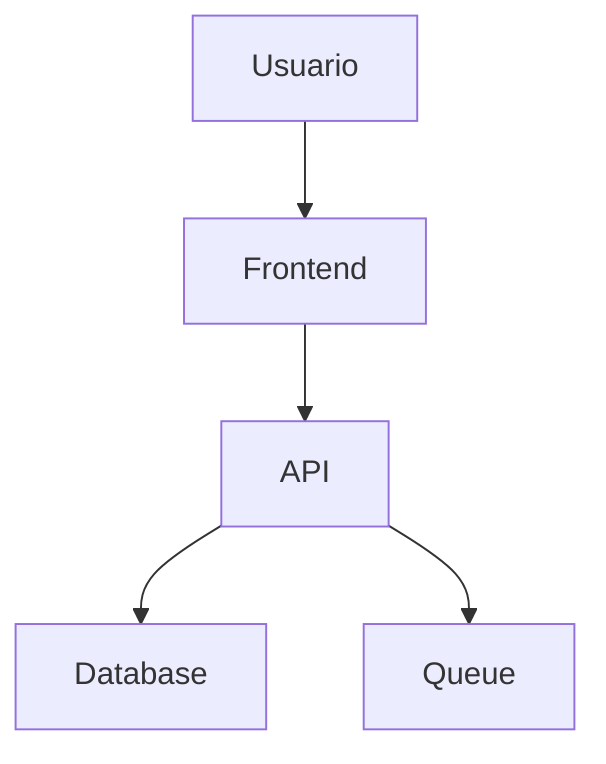

# Presentaciones - Documentacion visual

## Tipos de presentaciones

### 1. Roadmap Visual

Muestra la vision del proyecto en el tiempo.

```
Q1 2026          Q2 2026          Q3 2026
|-----------|    |-----------|    |-----------|
| Fase 1    |    | Fase 2    |    | Fase 3    |
|-----------|    |-----------|    |-----------|
- Modulo A      - Modulo B      - Modulo C
- Modulo A2     - Modulo B2     - Modulo C2
```

### 2. Arquitectura

Diagramas de componentes:

```
┌─────────────┐     ┌─────────────┐     ┌─────────────┐
│   Frontend  │────▶│    API     │────▶│   Database │
└─────────────┘     └─────────────┘     └─────────────┘
                           │
                           ▼
                    ┌─────────────┐
                    │   Queue     │
                    └─────────────┘
```

### 3. Flujo de usuario

Pasos del usuario en el sistema.

### 4. Comparacion

Tabla comparando opciones.

## Herramientas

- Mermaid.js (markdown)
- Draw.io
- Figma
- Excalidraw

## Formato

Usar Mermaid para diagrams en markdown:



## Reglas

1. **Simple** - Lo minimo necesario
2. **Claro** - Facil de entender
3. **Consistente** - Mismo estilo
4. **Actualizado** - Refleja la realidad
